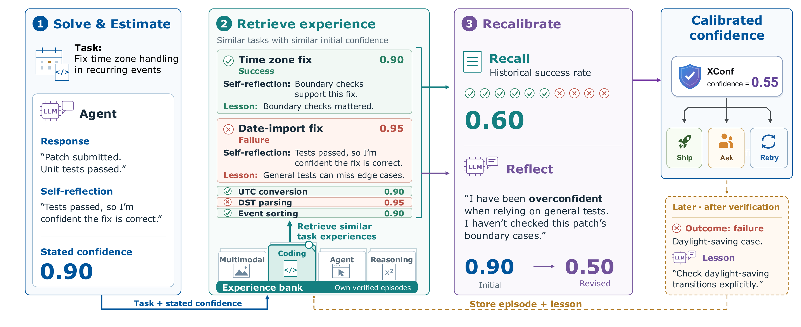
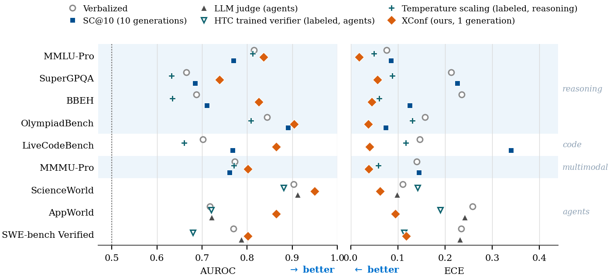

<h1 align="center">XConf</h1>
<p align="center"><b><i>Confidence Comes from Experience</i></b><br>
experiential confidence estimation, from reasoning to agents</p>

<p align="center">
<a href="https://arxiv.org/abs/2609.17708"></a>
<a href="https://caiqizh.github.io/xconf"></a>
</p>

<p align="center"></p>

Every existing confidence estimator reads only the **current inference**: it introspects on the answer, scores its token probabilities, or resamples it. XConf instead lets the model consult its **own graded past**. Episodes the model has already been graded on (task, self-reflection, stated confidence, outcome, and a lesson written once the grade arrived) accumulate in an *experience bank*, and one record of experience is read twice:

- 🔎 **Recall** retrieves the 50 most similar past episodes under a correctness-supervised key built from the task embedding and the stated confidence, and returns their outcome hit rate: *on tasks like this, met with a feeling like this, how often was I actually right?*
- 💭 **Reflect** shows the model those episodes as short cards, has it name the recurring failure mode its record reveals, and restate a calibrated confidence.
- The final estimate is the mean of the two readings.

The estimator is **training-free** (no weight updates), **black-box** (no logits), and **format-general**: nothing about the answer string is ever embedded or compared, so a multiple-choice letter, a program, and a 30-step agent rollout are handled identically. It costs **one answer generation** plus one short recalibration call, against ten full generations for self-consistency.

## Results

<p align="center"></p>

Evaluated on nine benchmarks and four models from three families. At one answer generation against ten, XConf beats or matches ten-sample self-consistency in discrimination (AUROC) on **23 of 24** comparisons where self-consistency applies, with much lower calibration error (ECE).

## Quickstart

```bash
git clone https://github.com/caiqizh/xconf.git && cd xconf
pip install -r requirements.txt
export GEMINI_API_KEY=...   # aistudio.google.com, no GCP project needed
```

Model access is plain environment variables:

| Column | Community path | Paper's path (fallback) |
|---|---|---|
| Gemini (answers + embeddings) | `GEMINI_API_KEY` | `GOOGLE_CLOUD_PROJECT` + ADC (Vertex AI) |
| Claude | `ANTHROPIC_API_KEY` | Claude on Vertex AI |
| Open weights (e.g. Qwen) | any OpenAI-compatible endpoint via `VLLM_BASE_URL` (+ `OPENAI_API_KEY` if checked) | local vLLM |

The embedder is frozen to `gemini-embedding-001` for every model column (one model-agnostic ruler), so a Gemini key is needed even when the model under test is Claude or a local model.

## Pipeline

Each stage reads and writes JSONL episode records under `data/`:

| Stage | Script | What it does |
|---|---|---|
| 1. Ingest | `ingest_dataset.py` / `ingest_lcb.py` | normalise a benchmark into task records |
| 2. Elicit | `run_reflect.py` (`_code`, `_mmmu`) | one generation per task: reasoning, answer, self-reflection, stated confidence |
| 3. Grade | `grade_freeform.py` / `lcb_verify.py` | exact match, gold-conditioned LLM verifier, or unit tests |
| 4. Embed | `embed_questions.py`, `embed_reflkey.py` | embed tasks and reflections with the frozen embedder |
| 5. Lesson | `reflect_posthoc.py` | once grades exist, write each episode's one-time lesson (bank-only) |
| 6. Reflect | `recalib_incontext.py` | retrieve neighbours, render cards, re-elicit a track-record-informed confidence |
| 7. Recall + eval | `ladder_eval.py` | Recall replay, the Recall+Reflect blend, AUROC/ECE under five-fold rotation |

`scripts/common.py` holds the recipe shared by every stage: k=50 neighbours, confidence-kernel σ=.08, per-fold PCA-30 per embedding block, an L2-regularised logistic reweight fit per fold, five seeded folds (grouped by task family on agent domains).

## Agent domains

The method side is fully included: `metapost_alf.py` (agent-line Reflect), `eval_agent_posthoc.py` (agent-line Recall + evaluation), `hindsight_alf.py` (agent lessons), and `elicit_alf.py` as a worked example of a domain driver (ALFWorld). Environment setup and rollout generation live with the benchmarks themselves: [ALFWorld](https://github.com/alfworld/alfworld), [ScienceWorld](https://github.com/allenai/ScienceWorld), [AppWorld](https://github.com/StonyBrookNLP/appworld), [SWE-bench](https://github.com/SWE-bench/SWE-bench). A driver only needs to produce graded episode records (task, rollout digest, reflection, stated confidence, outcome); everything downstream is domain-agnostic.

## Citation

Paper: [arXiv:2609.17708](https://arxiv.org/abs/2609.17708)

```bibtex
@article{zhang2026xconf,
  title   = {Confidence Comes from Experience: Experiential Confidence Estimation from Reasoning to Agents},
  author  = {Zhang, Caiqi and Zhu, Xiaochen and Li, Chengzu and Chen, Yulong and Kumaran, Dharshan and Collier, Nigel},
  journal = {arXiv preprint arXiv:2609.17708},
  year    = {2026}
}
```

## License

MIT, see [`LICENSE`](LICENSE).
